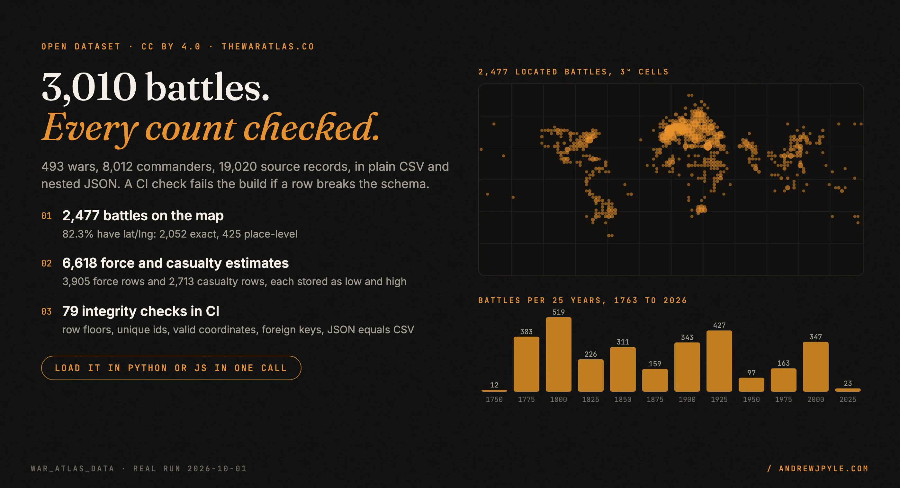
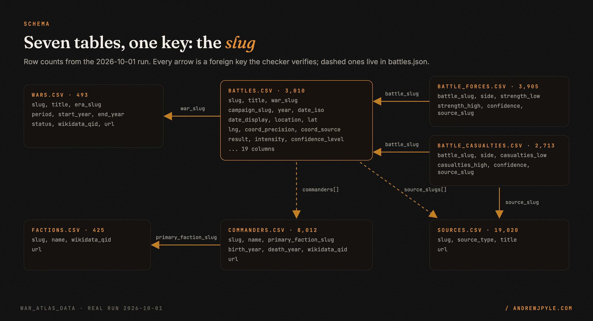
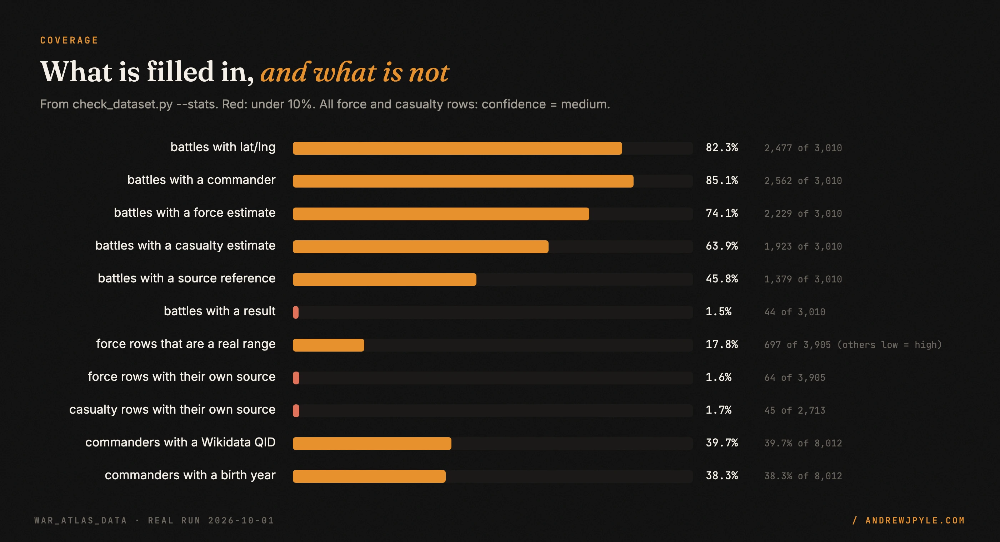

<p align="center">
  
</p>

<p align="center">
  <a href="https://github.com/Purcell-Analytics/war_atlas_data/actions/workflows/ci.yml"></a>
  
  
  
</p>

# The War Atlas open dataset: 3,010 battles across 493 wars

Structured facts behind [The War Atlas](https://thewaratlas.co): battles with dates, coordinates
and their precision, force-strength and casualty estimates, commanders, factions, and 19,020
bibliographic source records. Plain CSV plus one nested JSON file, no API key, CC BY 4.0.

This card says what is in the files and also what is missing. Every number below was computed from
the files by [`scripts/check_dataset.py`](scripts/check_dataset.py), and CI re-runs that check on
every push.

- **3,010 battles** in **325 wars** (493 wars are listed; 168 have no battles yet), dated 1763 to 2026.
- **2,477 battles with coordinates** (82.3%), each tagged `exact` or `place`-level, with where the point came from.
- **6,618 force and casualty estimates** (3,905 + 2,713), stored as `low` and `high`.
- **12,911 battle-to-commander links** and **9,886 battle-to-source links** in `battles.json`.

> **The one idea worth stealing, even if you never use this data:** publish the coverage next to
> the count. "3,010 battles with source-cited casualty ranges" sounds complete; "1,923 battles
> have a casualty estimate, and 45 of those rows name their own source" is what an analyst needs
> before trusting a chart. A dataset card that states its gaps is the one people can build on.

---

## 60 seconds to a first query

No clone needed. Python with pandas reads straight from GitHub
([`examples/quickstart.py`](examples/quickstart.py)):

```bash
pip install pandas
curl -sO https://raw.githubusercontent.com/Purcell-Analytics/war_atlas_data/main/examples/quickstart.py
python quickstart.py
```

```python
import os

import pandas as pd

# Reads straight from GitHub. Set WAR_ATLAS_BASE to a local folder (ending in /) to use a clone.
BASE = os.environ.get("WAR_ATLAS_BASE", "https://raw.githubusercontent.com/Purcell-Analytics/war_atlas_data/main/")


def load(name):
    # keep_default_na=False: only a truly empty cell is missing, so a side named "NA" stays a string.
    return pd.read_csv(BASE + name, keep_default_na=False, na_values=[""])


battles, forces, wars = load("battles.csv"), load("battle_forces.csv"), load("wars.csv")
```

Real output (captured in [`docs/assets/src/captures/quickstart_py.json`](docs/assets/src/captures/quickstart_py.json)):

```text
3,010 battles, 493 wars listed, 325 wars with at least one battle
2,477 battles have coordinates: {'exact': 2052, 'place': 425}
                    title  year           side  strength_low  strength_high
         Battles of Rzhev  1942   Soviet Union       3680300        3680300
            Great Retreat  1915 Russian Empire       2975695        2975695
    Battle of the Dnieper  1943   Soviet Union       2633000        2633000
Battle of the Oder–Neisse  1945   Soviet Union       2500000        2500000
            Great Retreat  1915  German Empire       2411353        2411353
```

JavaScript (Node 18+, no dependencies) loads the nested `battles.json` and turns it into GeoJSON
([`examples/quickstart.mjs`](examples/quickstart.mjs)):

```bash
curl -sO https://raw.githubusercontent.com/Purcell-Analytics/war_atlas_data/main/examples/quickstart.mjs
node quickstart.mjs
```

```text
3010 battles, 2477 as GeoJSON points
Battle of Ayacucho 1824 1824-12-09
  force  Patriots: 5780-8500
  force  Royalists: 6906-9310
  losses Royalists: 2500-2500
  4 commanders, 1 source references
```

Both examples run in CI against the checked-out files on every push.

## Files

| File | Rows | One row per |
|---|---:|---|
| `battles.csv` | 3,010 | battle |
| `battle_forces.csv` | 3,905 | force-strength estimate for one side of one battle |
| `battle_casualties.csv` | 2,713 | casualty estimate for one side of one battle |
| `wars.csv` | 493 | war |
| `commanders.csv` | 8,012 | commander (mostly people; some rows are units, e.g. `15th_army_group`) |
| `factions.csv` | 425 | faction |
| `sources.csv` | 19,020 | bibliographic source record |
| `battles.json` | 3,010 | battle, with nested `forces[]`, `casualties[]`, `commanders[]`, `source_slugs[]` |
| `manifest.json` | | snapshot version (`2026-07-03`), row counts, license, citation |
| `dataset-metadata.json` | | Kaggle dataset metadata |

## Schema

<p align="center"></p>

Every table is keyed by a `slug`. "Filled" is the share of rows where the field is non-empty.
Types are as they appear in the CSV; an empty cell means unknown.

**`battles.csv`**

| Field | Type | Filled | Notes |
|---|---|---:|---|
| `slug` | string, unique | 100% | primary key, e.g. `battle_of_ayacucho_b` |
| `title` | string | 100% | English title; not unique (see limitations) |
| `war_slug` | string, FK `wars.slug` | 100% | |
| `campaign_slug` | string | 3.2% | |
| `year` | integer | 100% | |
| `date_iso` | `YYYY-MM-DD` | 98.5% | year always equals `year`; 261 are `YYYY-01-01` (see limitations) |
| `date_display` | string | 100% | human-readable date or range |
| `location` | string | 1.5% | |
| `lat`, `lng` | decimal degrees | 82.3% | both or neither; all in range; none at (0, 0) |
| `coord_precision` | `exact` \| `place` | 82.3% | `exact`: 2,052, `place`: 425 |
| `coord_source` | `battle_p625` \| `located_in` | 82.3% | Wikidata coordinate (P625) of the battle, or of the place it is located in |
| `result` | string | 1.5% | |
| `intensity` | integer 0 to 100 | 100% | site-internal score; 1,011 battles are 0 |
| `confidence_level` | `low` \| `medium` \| `high` | 1.5% | |
| `is_indexable` | `True` \| `False` | 100% | site page indexing flag; 61 are `False` |
| `wikidata_qid` | `Q` + digits, unique | 100% | |
| `wikipedia_url` | URL | 100% | built from the title (see limitations) |
| `url` | URL | 100% | page on thewaratlas.co (redirects to a hyphenated path) |

**`battle_forces.csv`** and **`battle_casualties.csv`** (same shape)

| Field | Type | Filled | Notes |
|---|---|---:|---|
| `battle_slug` | string, FK `battles.slug` | 100% | one row per (battle, side), checked unique |
| `side` | string | 100% (1 empty) | free text, mixed languages (see limitations) |
| `strength_low`, `strength_high` / `casualties_low`, `casualties_high` | integer | 100% | `0 <= low <= high` holds on every row |
| `confidence` | `low` \| `medium` \| `high` | 100% | every row in this snapshot is `medium` |
| `source_slug` | string, FK `sources.slug` | 1.6% / 1.7% | 64 force rows and 45 casualty rows |

**`wars.csv`**

| Field | Type | Filled | Notes |
|---|---|---:|---|
| `slug` | string, unique | 100% | |
| `title` | string | 100% | |
| `era_slug` | string | 100% | 8 eras, e.g. `cold_war` (99 wars), `founding` (85) |
| `period` | string | 100% | display text, e.g. `1808-1833` |
| `start_year`, `end_year` | integer | 100% | `start_year <= end_year` on every row |
| `status` | `scaffolded` \| `modeled` | 100% | 461 scaffolded, 32 modeled |
| `wikidata_qid` | `Q` + digits | 100% | |
| `url` | URL | 100% | |

**`commanders.csv`**

| Field | Type | Filled | Notes |
|---|---|---:|---|
| `slug` | string, unique | 100% | 7,646 of 8,012 are linked from a battle |
| `name` | string | 100% | |
| `primary_faction_slug` | string, FK `factions.slug` | 15.7% | |
| `birth_year`, `death_year` | integer | 38.3% / 36.5% | |
| `wikidata_qid` | `Q` + digits | 39.7% | |
| `url` | URL | 100% | |

**`factions.csv`**: `slug` (unique, 100%), `name` (100%), `wikidata_qid` (39.8%), `url` (100%).

**`sources.csv`**: `slug` (unique, 100%), `source_type` (100%: 14,867 `monograph`, 4,142
`academic_journal`, 11 others), `title` (100%), `url` (58.5%). 10,903 slugs are ISBN-keyed
(e.g. `isbn-0333418379`); the rest are slugified titles.

**`battles.json`**: an array of the same 3,010 battles with every `battles.csv` field (numbers
typed, `lat`/`lng` `null` when unknown) plus `forces[]`, `casualties[]`, `commanders[]`
(`slug`, `name`, `side`, `rank`) and `source_slugs[]`. The checker confirms it agrees with the CSVs
field for field.

## Sample rows

One battle traced through every file (from [`captures/sample_rows.json`](docs/assets/src/captures/sample_rows.json)):

```text
battles.csv            battle_of_ayacucho_b | Battle of Ayacucho | war spanish_american_wars_of_independence
                       1824 | 1824-12-09 | -13.0425, -74.131667 | exact | battle_p625 | Q934157
battle_forces.csv      Patriots  5780-8500  medium | Royalists  6906-9310  medium
battle_casualties.csv  Royalists 2500-2500  medium
wars.csv               spanish_american_wars_of_independence | founding | 1808-1833 | scaffolded | Q1123201
commanders.csv         antonio_de_sucre | Antonio de Sucre | 1795-1830 | Q189779
factions.csv           peru_bolivian_confederation | Peru–Bolivian Confederation
sources.csv            quinto-centenario-1985 | academic_journal | Quinto Centenario | dialnet.unirioja.es
```

## Coverage

<p align="center"></p>

| | Count | Share |
|---|---:|---:|
| Battles with coordinates | 2,477 of 3,010 | 82.3% |
| Battles with at least one commander | 2,562 of 3,010 | 85.1% |
| Battles with a force estimate | 2,229 of 3,010 | 74.1% |
| Battles with a casualty estimate | 1,923 of 3,010 | 63.9% |
| Battles with either estimate | 2,475 of 3,010 | 82.2% |
| Battles with at least one source reference | 1,379 of 3,010 | 45.8% |
| Force rows where `low < high` (a real range) | 697 of 3,905 | 17.8% |
| Casualty rows where `low < high` | 601 of 2,713 | 22.2% |
| Force rows naming their own source | 64 of 3,905 | 1.6% |
| Casualty rows naming their own source | 45 of 2,713 | 1.7% |
| Wars with at least one battle | 325 of 493 | 65.9% |

Regenerate all of it with `python3 scripts/check_dataset.py --stats`.

## Provenance and sourcing method

- **Entities and coordinates.** Battle, war, commander and faction records are normalized largely
  from Wikidata (CC0) and cross-linked by slug. Every battle and war carries its Wikidata QID.
  `coord_source` says whether the point is the battle's own Wikidata coordinate (`battle_p625`,
  2,052 battles) or the coordinate of the place it is located in (`located_in`, 425).
- **Force and casualty figures.** Harvested from Wikipedia infoboxes and kept as `low`/`high`
  integers per side. Battles with no figure have no row; nothing is imputed.
- **Sources.** `sources.csv` holds bibliographic records (mostly ISBN-keyed monographs and journal
  articles). They are linked to battles at the **battle level** through `battles.json`
  `source_slugs[]`. Only 109 estimate rows link a source directly, and those point to a handful of
  US archive collections (Library of Congress, NARA, NPS, ABMC, VA).
- **No prose.** Harvested Wikipedia text (CC BY-SA) is excluded on purpose, so the compilation can
  be licensed CC BY 4.0. There are no description columns.
- **Snapshot.** This repo mirrors the files published at
  [thewaratlas.co/data](https://thewaratlas.co/data) as of version `2026-07-03` (see
  `manifest.json`). The site regenerates its copy as the catalogue grows, so it may be newer.

## Known limitations

Read these before drawing conclusions. Counts are from `--stats` on this snapshot.

1. **Most estimates are not row-level cited.** 64 of 3,905 force rows and 45 of 2,713 casualty
   rows have a `source_slug`. Battle-level references exist for 1,379 battles, but they are not tied
   to a specific number.
2. **`confidence` carries no signal in the estimate files.** Every force and casualty row is
   `medium`.
3. **Most "ranges" are single values.** 3,208 of 3,905 force rows and 2,112 of 2,713 casualty rows
   have `low == high`.
4. **`wikipedia_url` is built from the title**, not taken from Wikidata sitelinks (2,969 of 3,010
   equal `https://en.wikipedia.org/wiki/` + title). Same-named battles share a URL: 83 URLs are
   shared by 184 battles (e.g. the Battle of Bautzen of 1813 and of 1945), so at least one in each
   group points to the wrong or a disambiguation page. Use `wikidata_qid` to join to Wikipedia.
5. **Year-only dates look like January 1.** 261 battles have `date_iso` ending in `-01-01`, and
   `date_display` repeats it (e.g. the 1842 retreat from Kabul shows "January 1, 1842"). Treat
   `-01-01` as year precision unless you have checked it.
6. **War assignment is not always within the war's years.** 320 battles have a `year` outside
   their war's `start_year`..`end_year`. Some are framing (WWII is stored as `1941–1945 U.S.
   combat role`), some look misassigned (a 1952 clash filed under the 1882 Anglo-Egyptian War).
7. **`side` is free text in several languages** ("Royaume-Uni", "Югославия", "United Kingdom")
   and is not linked to `factions.csv`. Normalize before grouping by side.
8. **Not every row is a fought battle, and duplicates are possible.** For example
   `seven_days_to_the_river_rhine_b` is a 1979 Warsaw Pact exercise plan and carries a 2,000,000
   casualty figure. 5 title-and-year pairs appear twice with different QIDs (e.g. Battle of Arica,
   1880), and 3 Wikidata QIDs are shared by two factions (e.g. `east_india_company` and
   `british_east_india_company`). The checker does not adjudicate history.
9. **Sparse curated fields.** `result`, `location` and `confidence_level` exist for 44 battles;
   `campaign_slug` for 96.
10. **Coverage is uneven.** Located battles cluster in Europe and North America (see the map in the
    hero image), and the war eras follow US-history periods (`founding`, `continental_expansion`,
    `civil_war`).

## Integrity checks

`scripts/check_dataset.py` (standard library only) runs **79 named checks** and exits 1 on any
failure:

| Check family | What fails it |
|---|---|
| `rows.match_manifest`, `rows.floor` | a file whose row count disagrees with `manifest.json`, or drops below this snapshot's count |
| `schema.header`, `required` | a renamed or missing column; an empty required field |
| `types.*` | a non-integer year, intensity outside 0..100, a malformed QID or date, a date whose year disagrees with `year` |
| `coords.*` | lat without lng, out-of-range coordinates, (0, 0), precision without coordinates |
| `unique.*` | duplicate slugs, duplicate battle QIDs, two estimates for the same (battle, side) |
| `fk.*` | a battle pointing at a missing war, an estimate at a missing battle or source, a commander at a missing faction, a JSON link to a missing commander or source |
| `range.*` | `low > high`, negative values, an unknown confidence value |
| `json.*` | `battles.json` disagreeing with any CSV field, force row or casualty row |

```bash
python3 scripts/check_dataset.py           # 79/79 checks passed
python3 -m unittest discover -s tests -v   # 23 tests: each check proven able to fail
```

CI runs both, fails if fewer than 23 tests ran, then runs the two loading examples.

## Scope: what this dataset is not

- **Not a casualty authority.** The figures are infobox estimates, mostly uncited at row level. Do
  not publish a total from them without going back to sources.
- **Not complete.** It covers the battles The War Atlas has catalogued, weighted toward the eras
  the site started with. Absence of a battle means nothing.
- **Not reconciled across languages.** Side names are kept as harvested.
- **Not live.** A versioned snapshot; the site copy may be newer.

## The patterns

| Pattern | The failure it prevents |
|---|---|
| Coverage published next to every count | "3,010 battles with casualty ranges" read as 3,010 battles with casualty figures |
| `low`/`high` instead of one number | a contested figure collapsed into false precision |
| `coord_precision` + `coord_source` on every point | a city centroid plotted as if it were the battlefield |
| No row for an unknown figure | an imputed or zero value summed into a total |
| Row-count floors in CI | a truncated export that still parses and quietly ships |
| JSON checked against CSV | two formats of the same data drifting apart |

## FAQ

**Can I use this commercially?** Yes, under CC BY 4.0, with attribution (below).

**Why do some battles have no coordinates?** 533 battles have no usable Wikidata coordinate for
the battle or its location. They are left empty rather than guessed.

**Why do numbers on the site differ from this repo?** The site regenerates its export as the
catalogue grows; this repo is the `2026-07-03` snapshot.

**How do I join to Wikipedia reliably?** Use `wikidata_qid`, not `wikipedia_url` (limitation 4).

## Citation

```text
The War Atlas (2026). The War Atlas Open Dataset (version 2026-07-03) [Data set].
https://thewaratlas.co/data
```

```bibtex
@misc{thewaratlas_2026,
  title        = {The War Atlas Open Dataset},
  author       = {{The War Atlas}},
  year         = {2026},
  version      = {2026-07-03},
  howpublished = {\url{https://thewaratlas.co/data}},
  note         = {CC BY 4.0. Mirror: https://github.com/Purcell-Analytics/war_atlas_data}
}
```

## License

[CC BY 4.0](https://creativecommons.org/licenses/by/4.0/) (full text in [`LICENSE`](LICENSE)). You
may share and adapt the data for any purpose, including commercially, if you give attribution,
link to the license, and indicate changes. Suggested credit:

> Data: [The War Atlas](https://thewaratlas.co), thewaratlas.co, CC BY 4.0

Underlying facts are largely derived from Wikidata (CC0); the compilation, selection and curation
are licensed CC BY 4.0. The scripts and examples in this repo are covered by the same license.
